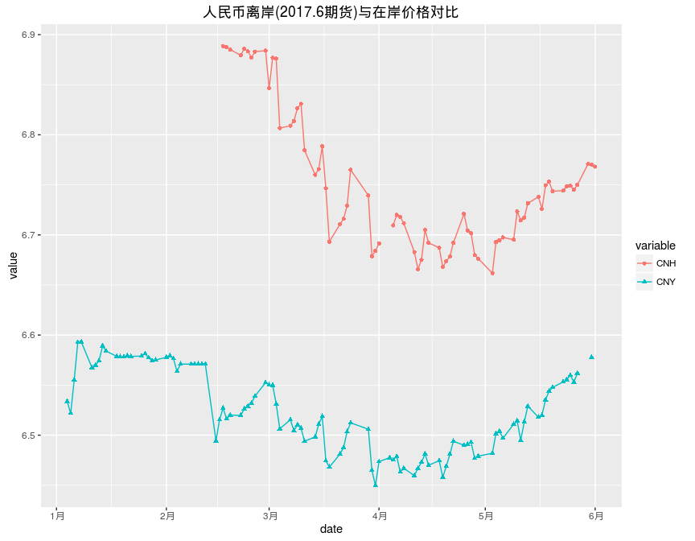
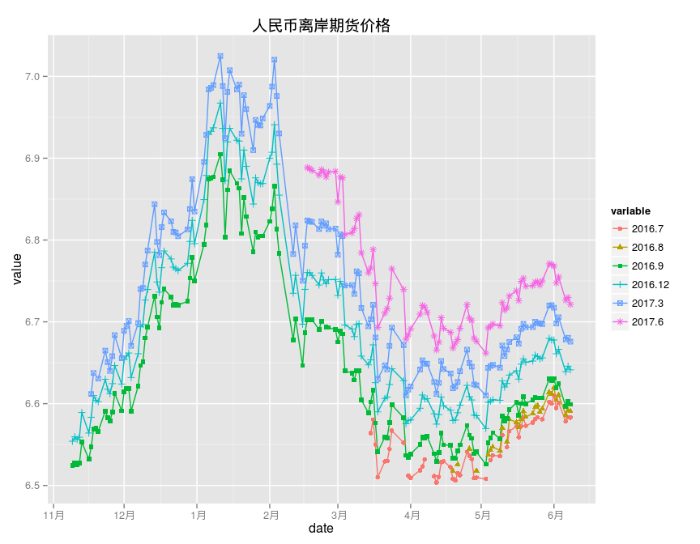
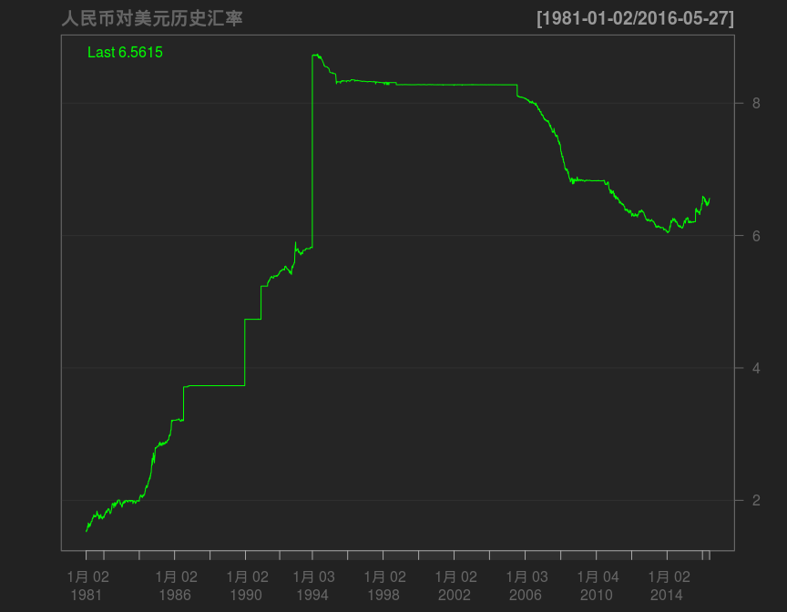

# 人民币汇率
qiufei  
2016-06-01  

# setup #


# 人民币汇率 离岸与在岸价格对比 #

CNH:https://www.quandl.com/data/HKEX/CUSM2017-US-Dollar-vs-Renminbi-Hong-Kong-USD-CNH-Futures-June-2017-CUSM2017
用的最后成交价.

CNY: https://www.quandl.com/data/BOE/XUDLBK73-Spot-exchange-rate-Chinese-Yuan-into-Dollar


Table: 近期人民币现货价格

       date         variable     value
-----  -----------  ---------  -------
2818   2016-05-25   CNY         6.5600
2819   2016-05-26   CNY         6.5530
2820   2016-05-27   CNY         6.5620
2821   2016-05-30   CNY             NA
2822   2016-05-31   CNY         6.5778
2823   2016-06-01   CNY             NA




# 离岸人民币期货 #




Table: 近期人民币期货价格

      date          2016.7   2016.8   2016.9   2016.12   2017.3   2017.6
----  -----------  -------  -------  -------  --------  -------  -------
134   2016-05-25    6.5833   6.5978   6.6070    6.6575   6.6985   6.7490
135   2016-05-26        NA   6.5900   6.6072    6.6548   6.6980   6.7450
136   2016-05-27    6.5810   6.5938   6.6070    6.6560   6.6973   6.7500
137   2016-05-30    6.6020   6.6142   6.6305    6.6798   6.7200   6.7709
138   2016-05-31    6.6001   6.6120   6.6284    6.6779   6.7204   6.7703
139   2016-06-01    6.6099   6.6196   6.6308    6.6778   6.7173   6.7682

从离岸期货价格看,人民币贬值预期明显.


# 人民币历史汇率 #


```
##                                                                         
## "Min.   :1.526  " "1st Qu.:3.731  " "Median :6.506  " "Mean   :6.133  " 
##                                                       
## "3rd Qu.:8.277  " "Max.   :8.741  "   "NA's   :400  "
```


