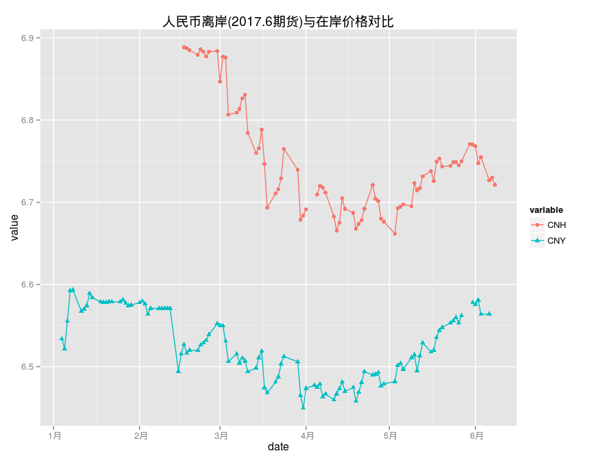

# 人民币汇率
qiufei  
2016-06-01  

# setup #

# 人民币汇率 离岸与在岸价格对比 #

CNH:https://www.quandl.com/data/HKEX/CUSM2017-US-Dollar-vs-Renminbi-Hong-Kong-USD-CNH-Futures-June-2017-CUSM2017
用的最后成交价.

CNY: https://www.quandl.com/data/BOE/XUDLBK73-Spot-exchange-rate-Chinese-Yuan-into-Dollar

Table: 近期人民币现货价格

       date         variable     value
-----  -----------  ---------  -------
2823   2016-06-01   CNY         6.5758
2824   2016-06-02   CNY         6.5811
2825   2016-06-03   CNY         6.5638
2826   2016-06-06   CNY         6.5642
2827   2016-06-07   CNY             NA
2828   2016-06-08   CNY             NA

<!-- -->

# 离岸人民币期货 #

<!-- -->

Table: 近期人民币期货价格

      date          2016.7   2016.8   2016.9   2016.12   2017.3   2017.6
----  -----------  -------  -------  -------  --------  -------  -------
139   2016-06-01    6.6099   6.6196   6.6308    6.6778   6.7173   6.7682
140   2016-06-02    6.5947   6.6046   6.6192    6.6610   6.6980   6.7475
141   2016-06-03    6.6010   6.6107   6.6245    6.6664   6.7056   6.7550
142   2016-06-06    6.5783   6.5864   6.5964    6.6390   6.6784   6.7265
143   2016-06-07    6.5833   6.5921   6.6028    6.6458   6.6806   6.7298
144   2016-06-08    6.5831   6.5907   6.5993    6.6414   6.6758   6.7213

从离岸期货价格看,人民币贬值预期明显.

# 人民币历史汇率 #

                                                                        
"Min.   :1.526  " "1st Qu.:3.731  " "Median :6.507  " "Mean   :6.133  " 
                                                      
"3rd Qu.:8.277  " "Max.   :8.741  "   "NA's   :400  " 
<!-- -->
